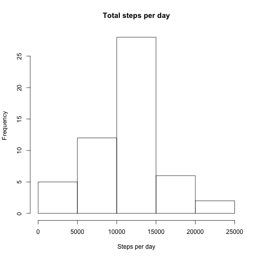
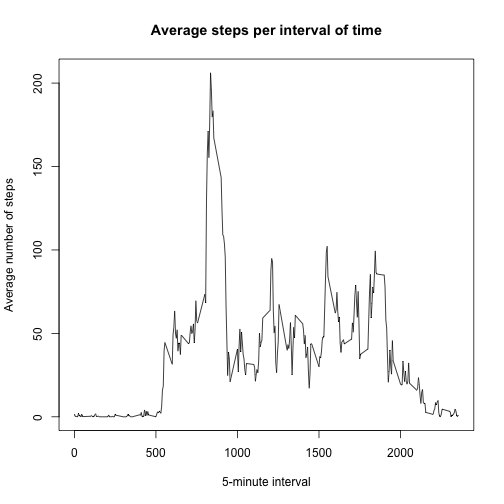
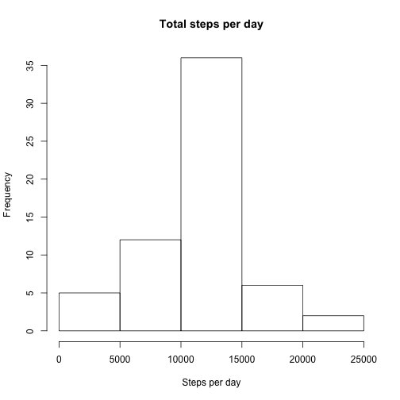
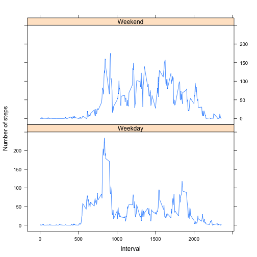

## Loading and preprocessing the data

```r
# The zip file was downloaded and placed in working directory.
datafile <- unzip("activity.zip")  # Unzip file
rawdata <- read.csv(datafile)  # Read data into data frame
```

## What is mean total number of steps taken per day?

```r
# Create new data frame for total steps per day
dailysteps <- data.frame(NA, levels(rawdata$date))
colnames(dailysteps) <- c("steps", "date")
for (i in levels(rawdata$date)) {  # Cycle through the various dates
    stepsperday <- rawdata$steps[rawdata$date == i]  # Extract daily steps
    dailysteps$steps[dailysteps$date == i] <- sum(stepsperday)  # Store total
}

# Draw histogram
hist(dailysteps$steps, main = "Total steps per day", xlab = "Steps per day")
```


 

```r
meandailysteps <- mean(dailysteps$steps, na.rm = TRUE)  # Calculate mean
mediandailysteps <- median(dailysteps$steps, na.rm = TRUE)  # Calculate median
```
The mean number of total steps taken per day are: 
    10766.  
The median number of total steps taken per day are: 10765.

## What is the average daily activity pattern?

```r
# Create new data frame for total steps per time interval
intervalsteps <- data.frame(NA, unique(rawdata$interval))
colnames(intervalsteps) <- c("steps", "interval")
for (i in unique(rawdata$interval)) {  # Cycle through the various intervals
    stepsperint <- rawdata$steps[rawdata$interval == i]  # Extract steps
    intervalsteps$steps[intervalsteps$interval == i] <- mean(stepsperint,
    na.rm = TRUE)  # Calculate average steps for the interval
}

# Draw time series plot
plot(intervalsteps$interval, intervalsteps$steps, xlab = "5-minute interval",
    ylab = "Average number of steps", type = "l")
title(main = "Average steps per interval of time")
```


 

```r
# Find interval containing maximum average steps
maxsteps <- max(intervalsteps$steps)  # Find maximum average steps
# Find corresponding interval
intervalofmaxsteps <- intervalsteps$interval[intervalsteps$steps == maxsteps]
```
The 5-minute interval containing the max number of steps is: 
    835.

## Imputing missing values

```r
missingcount <- sum(is.na(rawdata))
```
The total number of missing values is: 2304.


```r
# Fill in missing values with the mean number of steps for that time interval.
newdata <- rawdata  # Create new data frame
for (i in which(is.na(newdata))) {  # Cycle through indices of NA values
    newdata$steps[i] <- intervalsteps$steps[intervalsteps$interval == 
        newdata$interval[i]]  # Replace NA with mean steps for that interval
}

# Create new data frame for total steps per day
newsteps <- data.frame(NA, levels(newdata$date))
colnames(newsteps) <- c("steps", "date")
for (i in levels(newdata$date)) {  # Cycle through the various dates
    dailydata <- newdata[newdata$date == i,]  # Extract daily steps
    newsteps$steps[newsteps$date == i] <- sum(dailydata$steps)  # Store total
}

# Draw histogram
hist(newsteps$steps, main = "Total steps per day", xlab = "Steps per day")
```


 

```r
newmeansteps <- mean(newsteps$steps)  # Calculate mean
newmediansteps <- median(newsteps$steps)  # Calculate median
```
The new mean number of total steps taken per day are: 
    10766.  
The new median number of total steps taken per day are:
    10766.

## Are there differences in activity patterns between weekdays and weekends?

```r
# Add new column to original data frame for Weekday vs Weekend
rawdata$weekday <- ifelse(
    weekdays(as.Date(rawdata$date, format = "%Y-%m-%d")) == "Sunday" | 
    weekdays(as.Date(rawdata$date, format = "%Y-%m-%d")) == "Saturday",
    "Weekend", "Weekday")

# Create new data frame for average steps per interval for weekdays
weekdayintsteps <- data.frame(NA, unique(rawdata$interval), "Weekday")
colnames(weekdayintsteps) <- c("steps", "interval", "weekday")
# Create new data frame for average steps per interval for weekends
weekendintsteps <- data.frame(NA, unique(rawdata$interval), "Weekend")
colnames(weekendintsteps) <- c("steps", "interval", "weekday")
# Combine the two into a larger data frame
weekdayintsteps <- rbind(weekdayintsteps, weekendintsteps)
for (i in unique(rawdata$interval)) {  # Cycle through the time intervals
    tmpintdata1 <- rawdata$steps[rawdata$interval == i & 
        rawdata$weekday == "Weekday"]  # Extract all weekday steps
    tmpintdata2 <- rawdata$steps[rawdata$interval == i & 
        rawdata$weekday == "Weekend"]  # Extract all weekend steps
    weekdayintsteps$steps[weekdayintsteps$interval == i & 
        weekdayintsteps$weekday == "Weekday"] <- 
        mean(tmpintdata1, na.rm = TRUE)  # Calculate mean steps for weekdays
    weekdayintsteps$steps[weekendintsteps$interval == i & 
        weekdayintsteps$weekday == "Weekend"] <- 
        mean(tmpintdata2, na.rm = TRUE)  # Calculate mean steps for weekends
}

# Draw time series plot for average weekday steps vs weekend steps per interval
xyplot(weekdayintsteps$steps ~ weekdayintsteps$interval | 
    weekdayintsteps$weekday, main = "", type = "l", layout = c(1,2),
    ylab = "Number of steps", xlab = "Interval")
```


 
  
It can be seen that there is more activity throughout the day during weekends.
